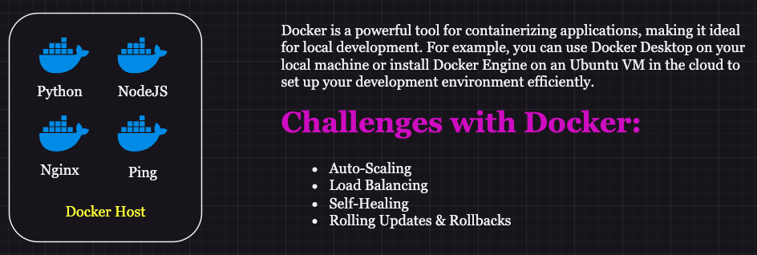
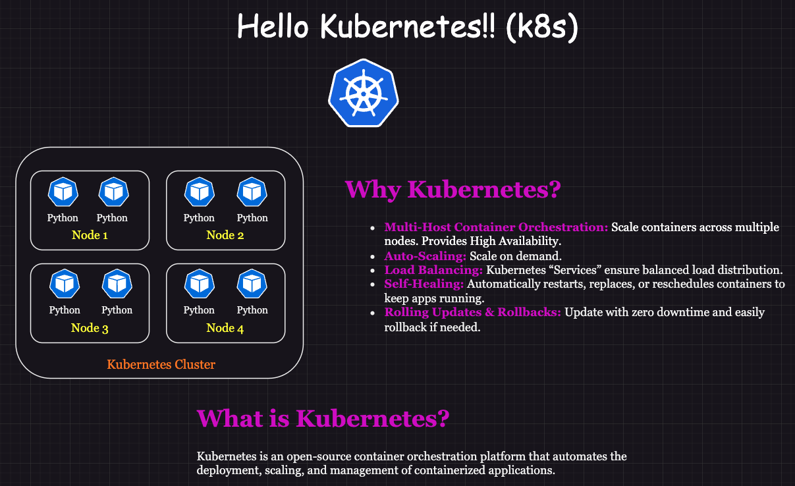

## **Welcome to Kubernetes: Why it exists and what it actually is**

---

## **Challenges of Using Docker Alone**

### **Auto‑Scaling**
Docker cannot automatically scale containers based on load or resource usage. To achieve dynamic scaling, you must rely on external orchestration platforms like Kubernetes.

### **Load Balancing**
Docker does not provide advanced, built‑in load‑balancing across multiple containers or hosts. Effective load distribution requires third‑party tools or manual configuration.

### **Self‑Healing**
Docker lacks native self‑healing features. It cannot automatically restart failed containers or maintain application stability the way Kubernetes does.

### **Rolling Updates and Rollbacks**
Docker by itself cannot perform seamless rolling updates or rollbacks. These capabilities are essential for zero‑downtime deployments and safe version reversions, and they require an orchestrator.

---

## **Hello Kubernetes**

### **Why Kubernetes?**
Kubernetes is far more than a container orchestration tool—it is the industry standard for running containers at scale.  
Docker packages and runs individual containers, but Kubernetes coordinates and manages containers across clusters of machines.

Kubernetes automates deployment, scaling, load balancing, and self‑healing, ensuring applications remain resilient and highly available.

---

## **Kubernetes vs. Docker Swarm vs. Docker Compose**

### **High‑Level Comparison**

| Feature | Kubernetes | Docker Swarm | Docker Compose |
|--------|------------|--------------|----------------|
| **Scope** | Manages containerized apps across multi‑node clusters with automated deployment and scaling | Basic orchestration for Docker containers on a single host or small cluster | Defines and runs multi‑container apps on a single machine |
| **Complexity** | Most complex; supports quotas, schedulers, advanced networking | Simpler; focuses on lightweight clustering | Easiest; ideal for local development |
| **Scalability** | Built for massive, production‑grade scaling | Moderate scaling; suitable for small/medium clusters | Limited to single‑host setups |
| **Features** | Auto‑scaling, self‑healing, service discovery, load balancing, secrets, rolling updates | Basic service discovery, manual scaling, simple rolling updates | Defines services, networks, volumes for local multi‑container apps |
| **Learning Curve** | Steep; requires understanding manifests, cluster behavior, and troubleshooting | Easier; requires Docker knowledge and basic cluster setup | Very easy; minimal configuration |
| **Community & Ecosystem** | Large ecosystem (Helm, Prometheus, Istio) | Smaller, Docker‑focused community | Widely used for development workflows |
| **Use Cases** | Large‑scale production, microservices, distributed systems | Small production clusters or test environments | Local development and small non‑critical apps |
| **State Management** | Supports StatefulSets, Persistent Volumes, ConfigMaps | Limited stateful support; relies on external storage | Mostly stateless; volumes available |
| **Networking** | Advanced networking (Ingress, service mesh, policies) | Basic overlay networking | Minimal networking features |
| **Installation** | Complex; requires kubectl, kubeadm, or managed services (EKS, GKE, AKS) | Simple; enable Swarm mode in Docker | Very simple; just a YAML file |
| **Fault Tolerance** | High; automatic rescheduling and rolling updates | Moderate; leader election and restarts | Low; intended for development environments |

---

## **Key Characteristics Summary**

| Characteristic | Kubernetes | Docker Swarm | Docker Compose |
|----------------|------------|--------------|----------------|
| **Orchestration** | Yes (multi‑host) | Yes (multi‑host within Swarm) | No |
| **Scaling** | Automatic + manual | Manual + limited automatic | Manual |
| **Load Balancing** | Built‑in, advanced | Basic routing mesh | None |
| **Self‑Healing** | Robust | Limited | No |
| **Multi‑Host Support** | Yes | Yes | No |
| **Networking** | Advanced | Basic | Limited |
| **Use Case** | Large‑scale production | Small clusters | Local development |

---
