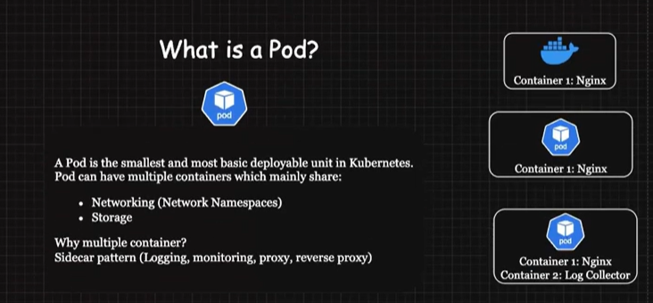
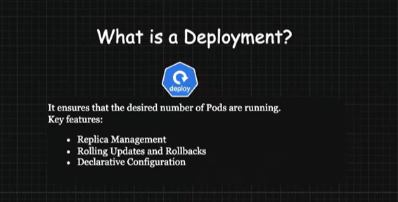
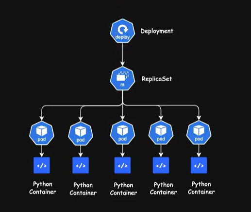
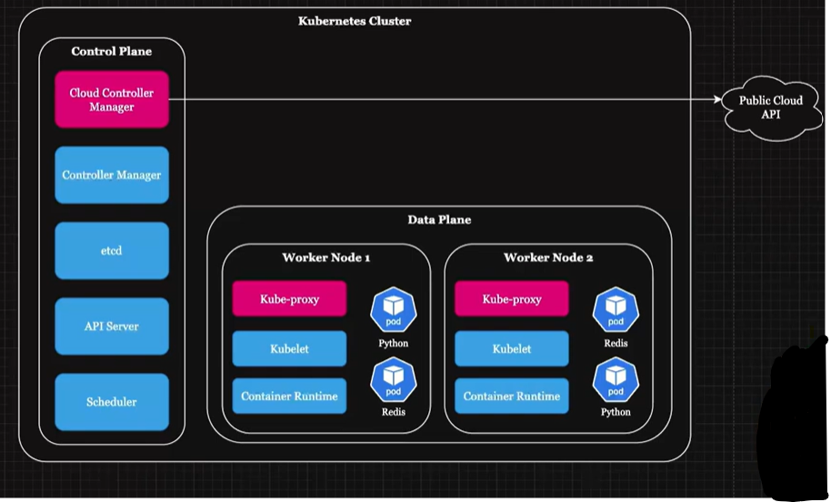
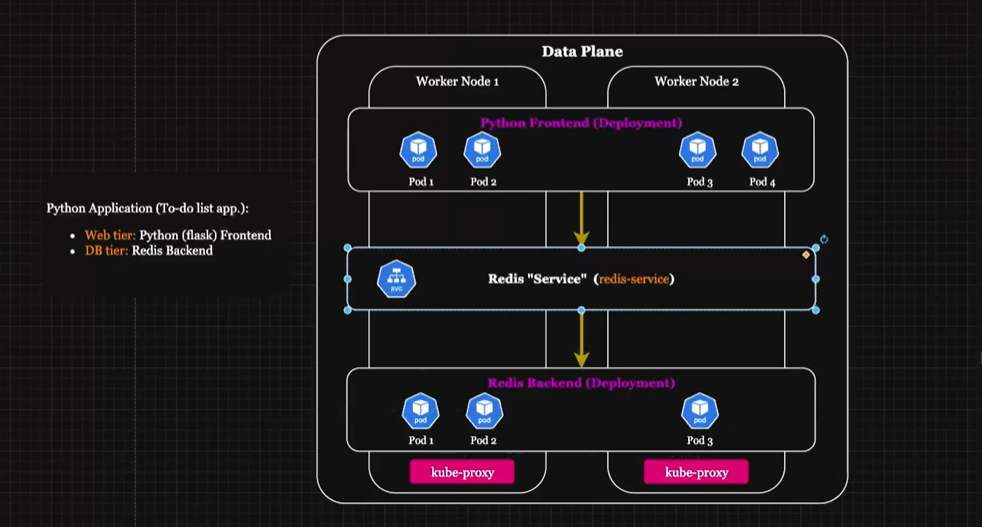
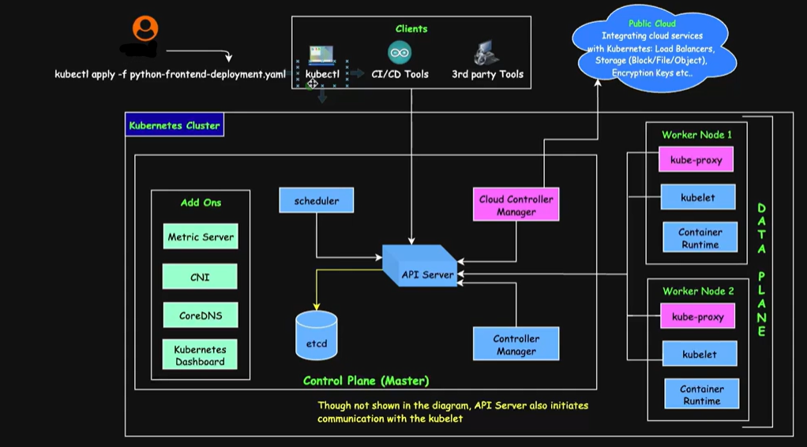

## **Kubernetes Architecture & Deployment Creation Workflow**

---

**What is Pod?**  

**What are Network namespaces?**  
Network namespaces in Kubernetes provide an isolated network environment for each Pod. Each Pod has its own unique network namespace, which means it has its own IP address, network interfaces, and routing tables.  
All containers within a Pod share the same network namespace, meaning they can communicate with each other using localhost and have direct access to each other’s ports.  
This isolation ensures that Pods can communicate with each other using their internal IPs, but also keeps them separated from other Pods' networks within the cluster.

**What is a Deployment?**  

Deployments wrap ReplicaSets to manage scaling and updates. A Deployment ensures that the desired number of Pods are running and takes care of versioning and rolling updates.  
ReplicaSets wrap Pods by maintaining a stable set of replica Pods and ensuring that the specified number of Pods are running at all times, even in case of Pod failure.  
Pods wrap Containers. A Pod is the smallest deployable unit in Kubernetes, and it contains one or more containers that share the same network namespace and storage volumes.

**Kubernetes Architecture**  
  

Kubernetes operates on a master-worker architecture, where:

**Control Plane**  
Role: This is the brain of the cluster, responsible for managing and orchestrating all the worker nodes.  
Description: It's a set of core components that run on a separate set of machines.

**Worker Nodes**  
Role: These are the machines where your applications actually run.  
Description: They execute the instructions received from the control plane.

**Control Plane Components**

**etcd**  
A distributed key-value store that stores all the cluster's configuration data.

**API Server**  
The front-end for the Kubernetes control plane.  
Exposes the Kubernetes API, allowing users and tools to interact with the cluster.

**Scheduler**  
Assigns Pods to worker nodes based on resource availability and other constraints.

**Controller Manager**  
Implements control loops that ensure the desired state of the cluster is maintained.  
Handles tasks like replication, scaling, and garbage collection.

**Cloud Controller Manager (CCM)**  
Integrates Kubernetes with the cloud provider.  
It manages cloud-specific resources and interacts with the cloud provider's API.

**Data Plane Components**

**Kubelet**  
An agent that runs on each worker node.  
Communicates with the control plane and ensures that containers are running as expected.

**Kube-proxy**  
A network proxy that runs on each worker node.  
Handles network routing and service discovery within the cluster.

**Container Runtime**  
The software responsible for running containers on the worker nodes (e.g., containerd, CRI-O, Podman, Rocket).

**Control Plane vs Data Plane**

| Feature | Control Plane | Data Plane |
|---------|----------------|------------|
| Responsibility | Manages the cluster | Runs applications |
| Components | etcd, API Server, Scheduler, Controller Manager, Cloud Controller Manager | Kubelet, Kube-proxy, Container Runtime |
| Location | Typically on dedicated machines or in a highly available configuration | On each worker node |
| Focus | Orchestration, management, and control | Running applications and managing resources |

---

**Kubernetes: Python Frontend, Redis Service, kube-proxy, and CNI Interaction**  

**Python Frontend to Redis Service:**  
The Python frontend attempts to connect to the Redis Service using the Service’s DNS name. DNS name to IP translation is primarily performed by CoreDNS, which replaced kube-DNS as the default DNS server within Kubernetes.

**kube-proxy’s Role:**  

**Interception:** kube-proxy on the node where the Python frontend Pod is running intercepts the outgoing network traffic destined for the Redis Service’s ClusterIP.

**Service-to-Pod Mapping:** kube-proxy determines which specific Redis Pod should handle the request by referring to the Service’s Endpoint object, which contains the IP addresses of all healthy backend Pods. kube-proxy performs:

- **Load Balancing:** It selects a Redis Pod based on the load balancing strategy defined for the Service (e.g., round-robin or IPVS-based algorithms).  
- **Health Checks:** Ensures that the Redis Pod selected for routing is healthy and available to handle requests.  
- **Traffic Redirection:** kube-proxy redirects the traffic from the Python frontend Pod to the chosen Redis Pod by modifying the packet’s destination IP and port.

**CNI’s Role:**  

**Network Setup:** CNI ensures that all Pods, including the Python frontend and Redis Pods, are assigned unique IP addresses within the cluster and can communicate seamlessly.

**Traffic Routing:**  
- **From Python Frontend to Redis Pod:** CNI ensures that the traffic routed by kube-proxy can traverse the cluster’s network infrastructure correctly to reach the selected Redis Pod.  
- **Pod-to-Pod Communication:** The CNI plugin implements the network routes and rules that enable communication between Pods across different nodes.

**Redis Pod Response:**  
The selected Redis Pod processes the request and sends the response directly back to the originating Python frontend Pod.

**Direct Return:** Kubernetes networking ensures the return traffic takes the reverse path directly, avoiding kube-proxy, because the connection has already been established.

**Return Path:**  
The response traffic from the Redis Pod is sent directly to the Python frontend Pod, using the same network setup provided by CNI.  
Direct Communication: Since the communication is already established, kube-proxy is not involved in the return path.

**Key Roles in This Interaction:**

**CNI (Container Network Interface):**  
Provides the fundamental networking infrastructure, including IP address assignment, routing, and connectivity for all Pods in the cluster.  
Ensures traffic between Pods on the same or different nodes is routed correctly through the cluster network.

**kube-proxy:**  
Acts as a traffic director for requests made to Services.  
Implements the routing and load-balancing logic for traffic sent to the Redis Service, ensuring requests are forwarded to a healthy Redis Pod.

**Redis Service:**  
Serves as a stable abstraction layer, hiding the dynamic nature of Pod IP addresses from the Python frontend.  
Provides a consistent entry point (ClusterIP or DNS) for communication with the Redis deployment and handles load balancing via kube-proxy.

---

**Example Flow: Communication Between Pods**

**Step-by-Step Flow:**

**Python Frontend Pod Sends Request:**  
The Python frontend Pod sends a request to the Redis service (e.g., redis-service:6379).

**kube-proxy Intercepts Traffic:**  
kube-proxy intercepts the traffic and looks up the Redis Service’s endpoints to find a healthy Redis Pod.

**Traffic Forwarded to Redis Pod:**  
After finding a healthy Redis Pod, kube-proxy forwards the request to that Redis Pod.

**Redis Pod Processes the Request:**  
The Redis Pod processes the request and sends the response directly back to the Python frontend Pod.

This process ensures seamless communication between services in the Kubernetes cluster, with kube-proxy handling the routing of traffic to the appropriate Pods.

**Additional Considerations:**  
- **CNI Plugins:** Some advanced CNI plugins (e.g., Calico, Cilium) can offload service-to-pod routing directly, potentially reducing kube-proxy’s role.  
- **Service Type Impact:** Depending on the Service type (e.g., ClusterIP, NodePort, or LoadBalancer), the traffic path and kube-proxy’s role might differ slightly. We will discuss Service Types in detail in future lessons.

---

**Kubernetes Deployment Workflow**  

This process outlines the steps that occur when you apply a Kubernetes Deployment, from creation to Pod scheduling and running.

---

### **1. User Initiates Deployment Creation**

**Command:**  
The user runs `kubectl apply -f python-frontend-deployment.yaml` to create a new Deployment.

**kubectl Action:**  
- Validates the YAML file for:  
  - Syntax (e.g., proper formatting, indentation).  
  - Basic Kubernetes schema correctness (e.g., valid API versions, resource definitions).  
- Sends the validated Deployment object to the API Server.

---

### **2. API Server Actions**

The API Server receives the validated Deployment object and performs the following tasks:

**Authentication and Authorization:**  
Verifies that the user has the correct permissions to create the Deployment.

**Validation:**  
Ensures the Deployment object conforms to the complete Kubernetes schema.

**Storage:**  
Stores the desired state of the Deployment in etcd (the cluster’s database).  
This includes details such as the Deployment's metadata, desired number of Pods, and Pod template.

**Response:**  
Returns a success message (e.g., "deployment created") to the user.

---

### **3. Deployment Controller Workflow**

The Deployment Controller is part of the Controller Manager and ensures that the desired number of Pods are running in your cluster.

**How It Works:**  
The Deployment Controller continuously watches the API Server for any changes to Deployment objects.  
It compares the desired state (e.g., number of Pods defined in the Deployment) with the actual state (number of Pods currently running in the cluster).

**What Happens When Desired State Differs?**

**ReplicaSet Creation:**  
The Deployment Controller instructs the API Server to create a ReplicaSet object.  
The API Server stores the ReplicaSet object in etcd.

**Pod Creation:**  
The ReplicaSet Controller monitors the ReplicaSet object via the API Server (not directly in etcd).  
If Pods are needed (e.g., scaling or Pod failure):  
- The ReplicaSet Controller instructs the API Server to create the required Pod objects.  
- The API Server stores the new Pod objects in etcd.

**Note:**  
At this stage, only the Pod objects are created and stored in etcd.  
The actual containers inside these Pods will be created later when the Kubelet starts managing the Pods on the assigned nodes.

**Status Update:**  
The Deployment Controller updates the Deployment object in the API Server to reflect the current state, including:  
- The number of available Pods  
- The number of ready Pods  

A Pod is considered "ready" only when all of its containers are running and healthy.

---

### **4. Scheduler's Role**

The Scheduler is responsible for assigning unscheduled Pods (Pods without a nodeName) to appropriate nodes.

**How It Works:**  
The Scheduler watches the API Server for Pod objects with no nodeName.  
For each unscheduled Pod, the Scheduler selects a suitable node based on:  
- Resource availability (CPU, memory)  
- Node affinities  
- Taints and tolerations  

The Scheduler updates the Pod object in the API Server, adding the nodeName to indicate where the Pod will run.  
The updated Pod object is stored in etcd via the API Server.

---

### **5. API Server Updates the Pod Status**

The API Server receives the node selection from the Scheduler.  
It updates the Pod object in etcd with the nodeName to indicate the assigned node.

---

### **6. Kubelet's Role**

The Kubelet on the assigned node monitors the API Server for changes to Pod objects.

**How It Works:**  
The Kubelet detects the new Pod scheduled to its node by watching the API Server.  
The Kubelet retrieves the Pod object from the API Server, which includes details about:  
- Container specifications  
- Network and volume configurations  

**Kubelet Actions:**

**Container Runtime Interface (CRI):**  
The Kubelet interacts with the container runtime (e.g., containerd, CRI-O) to:  
- Pull container images from the registry  
- Configure networking using the CNI plugin  
- Mount volumes specified in the Pod definition  
- Create and start containers inside the Pod  

**Health Monitoring:**  
The Kubelet continuously monitors the health of the containers and updates their status in the API Server.  
These updates are stored in etcd.

---

### **7. Pod Running**

Once the containers are running, the Pod is live on the assigned node.

**Deployment Controller:**  
Manages the ReplicaSet, ensuring it maintains the desired state.  
Does not directly monitor or recreate Pods; this is handled by the ReplicaSet Controller.

**ReplicaSet Controller:**  
Monitors Pods via the API Server.  
If a Pod fails or is terminated, it detects the discrepancy and recreates the missing Pod.

**Key Points:**  
- The Kubelet monitors container health and status.  
- It reports container status to the API Server.  
- The API Server updates the Pod’s status in etcd.

---

