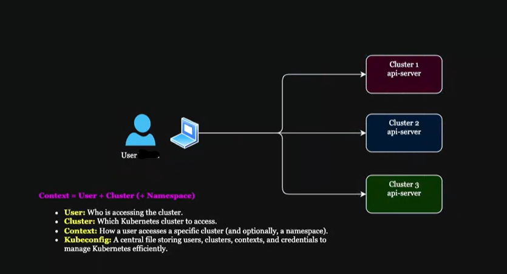

## **Setting Up Kind Cluster Locally & Kubernetes Context**

---

## **Important Installation References**
- Kubectl Installation Documentation  
- Kind Cluster Installation Documentation  

---

## **Summary of What We Did**
We created Kubernetes clusters using Kind from the command line in two different ways.  
Below is a clear breakdown of how each scenario differs.

---

## **Scenario 1: `my-first-cluster` (Using a Configuration File)**

Cluster created with:

```bash
kind create cluster --name my-first-cluster --config kind-cluster.yaml
```

### **kind-cluster.yaml**

```yaml
# kind-cluster-config.yaml
kind: Cluster
apiVersion: kind.x-k8s.io/v1alpha4

# Specify the Kubernetes version by using a specific node image
# Visit https://hub.docker.com/r/kindest/node/tags and https://github.com/kubernetes-sigs/kind/releases for available images
nodes:
  - role: control-plane
    image: kindest/node:v1.36.1@sha256:3489c7674813ba5d8b1a9977baea8a6e553784dab7b84759d1014dbd78f7ebd5
  - role: worker
    image: kindest/node:v1.36.1@sha256:3489c7674813ba5d8b1a9977baea8a6e553784dab7b84759d1014dbd78f7ebd5
  - role: worker
    image: kindest/node:v1.36.1@sha256:3489c7674813ba5d8b1a9977baea8a6e553784dab7b84759d1014dbd78f7ebd5
```

### **What the configuration file defines**
- Kubernetes node image version  
- Number of nodes  
- Roles (control-plane, workers)

### **Why configuration files are preferred**
- They support version control and change tracking.  
- They follow declarative infrastructure practices—consistent, reproducible, and environment‑friendly.  
- They can be shared across teams for standardization.  
- They serve as a single source of truth, reducing manual errors.

This approach mirrors how other DevOps tools operate—Terraform, Ansible, Helm, and Kubernetes itself rely heavily on YAML manifests for defining infrastructure and deployments. YAML remains popular for its readability and flexibility, though JSON is also supported when needed.

---

## **Scenario 2: `my-second-cluster` (Using Default Settings)**

Cluster created with:

```bash
kind create cluster --name my-second-cluster
```

### **Characteristics of this approach**
- Uses the default latest node image.  
- Can be customized with `--image` if needed.  
- Faster for simple setups but lacks:
  - Version control  
  - Declarative reproducibility  
  - Maintainability  

---

## **Important Note About Naming in Kind**
Kind automatically uses the cluster name for:
- The cluster  
- The context  
- The user  

This can feel confusing, especially compared to production environments where these names are intentionally distinct.  
You’ll see this difference clearly when we build clusters using **kubeadm**, where naming is more explicit and customizable.

---

## **Managing Kubernetes Contexts Across Multiple Clusters**

Kubernetes contexts make it easy to work with multiple clusters by storing cluster, user, and namespace information inside the `kubeconfig` file. Each context represents a combination of:

- A cluster  
- A user  
- A namespace  

This allows seamless switching without manually editing configuration details.



---

## **Scenario Example**
I need access to three clusters:

1. Development  
2. Staging  
3. Production  

Using contexts, I can switch between them effortlessly.

---

## **How Contexts Work**

### **1. Defining Contexts**
Each context in the kubeconfig file includes:
- Cluster details (API server, CA cert)  
- User credentials  
- Default namespace  

### **2. Switching Contexts**
I can switch between clusters using:

```bash
kubectl config use-context <context-name>
```

Examples:

```bash
kubectl config use-context dev-context
kubectl config use-context staging-context
kubectl config use-context prod-context
```

---

## **Namespaces**
A namespace is a virtual cluster inside a physical cluster.  
It isolates resources so multiple environments (dev, staging, prod) can coexist safely.

We’ll explore namespaces in depth later, but they’re included here for completeness.

---

## **Example kubeconfig**

```yaml
apiVersion: v1
clusters:
- name: cluster-1
  cluster:
    server: https://cluster-1-api-server
    certificate-authority-data: <certificate-data>
- name: cluster-2
  cluster:
    server: https://cluster-2-api-server
    certificate-authority-data: <certificate-data>
- name: cluster-3
  cluster:
    server: https://cluster-3-api-server
    certificate-authority-data: <certificate-data>

users:
- name: Adekunle-user
  user:
    client-certificate-data: <client-cert-data>
    client-key-data: <client-key-data>

contexts:
- name: dev-context
  context:
    cluster: cluster-1
    user: Adekunle-user
    namespace: dev
- name: staging-context
  context:
    cluster: cluster-2
    user: Adekunle-user
    namespace: staging
- name: prod-context
  context:
    cluster: cluster-3
    user: Adekunle-user
    namespace: prod

current-context: dev-context
```

---

## **Using Contexts Effectively**

### **Switching Contexts**
```bash
kubectl config use-context dev-context
kubectl config use-context staging-context
kubectl config use-context prod-context
```

### **Overriding Namespace**
```bash
kubectl get pods --namespace=dev
```

### **Setting a Default Namespace**
```bash
kubectl config set-context --current --namespace=app1-ns
```

### **Checking Current Context**
```bash
kubectl config current-context
```

### **Listing All Contexts**
```bash
kubectl config get-contexts
```

Using contexts, commands (like kubectl get pods) are sent to the correct cluster without having to manually specify the cluster or user details every time. It helps to prevent mistakes where a command meant for one cluster is executed on another cluster by accident.

---

